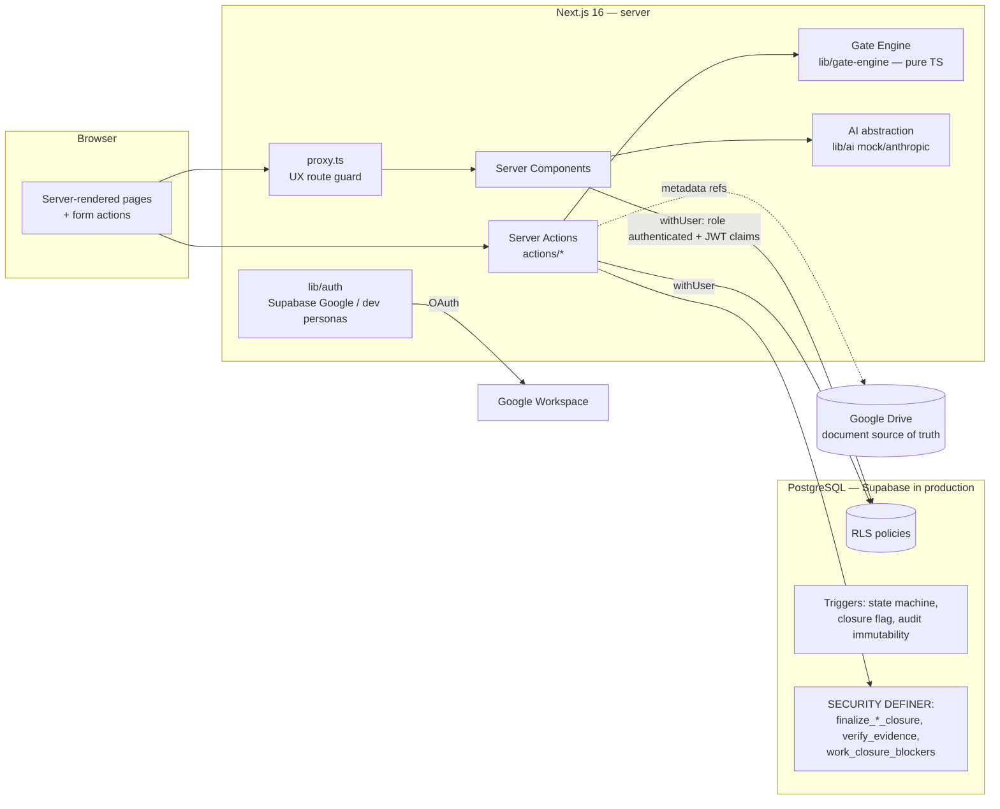

# Architecture

## Overview

## Key properties

1. **Database-enforced authorization.** Every request-scoped query runs in a transaction
   as role `authenticated` with `request.jwt.claims` set (lib/db). RLS decides row access;
   the frontend only *hides* what the DB already *denies*. See docs/AUTH_AND_RLS.md.
2. **Three-layer closure control** (D-005): UI exposes only valid actions; RLS blocks
   `status='CLOSED'` writes; the state-machine trigger requires a transaction-local flag
   that only `app.finalize_work_closure()` (SECURITY DEFINER) sets — after re-verifying
   closure conditions in SQL (`app.work_closure_blockers`) and the signer's authority.
3. **Deterministic Gate Engine** is pure TypeScript (`lib/gate-engine/engine.ts`), no I/O,
   no AI, clock injected — fully unit-tested. Server actions load a snapshot, evaluate,
   and persist immutable `gate_runs` + `gate_findings`.
4. **AI is advisory.** `lib/ai` defines the provider interface; the agent receives only
   structured rows the caller may read (RLS applies during context building) and has no
   write path. Providers: `mock` (no key, echoes grounded data) and `anthropic` (REST).
5. **Portability.** The data layer is plain Postgres (node-postgres). Local PostgreSQL,
   Supabase, or a future enterprise Postgres are interchangeable via `DATABASE_URL`.
   Supabase-specific code is confined to `lib/auth/supabase.ts` (OAuth only).

## Module map

| Path | Responsibility |
|---|---|
| `app/(app)/*` | Authenticated pages: dashboard, okr, work, evidence, reviews, approvals, agent, reports, admin, notifications |
| `app/(auth)/login`, `app/auth/callback`, `app/unauthorized` | Sign-in flows |
| `actions/*` | Server actions: work lifecycle, evidence/deliverables, OKR/quarter closure, admin, auth, notifications |
| `lib/db` | Pool + `withUser` (RLS-enforcing transactions) + `withService` |
| `lib/auth` | Session resolution: Supabase Google → employee link; gated dev personas |
| `lib/gate-engine` | Types, work/KR/quarter evaluation, snapshot loader, gate-run persistence |
| `lib/workflow/state-machine.ts` | Allowed transitions + context actions (mirrors DB trigger) |
| `lib/okr/calc.ts` | Weighted achievement, weight validation, metric operators |
| `lib/next-actions.ts` | Deterministic prioritized next actions |
| `lib/ai` | Provider abstraction, agent grounding, authority boundary |
| `lib/drive` | Drive URL parsing/validation, metadata fetch, folder convention |
| `supabase/migrations` | Schema, triggers, RLS — reproducible from scratch |
| `scripts/` | Local DB setup, OKR import, pilot data generator |
| `tests/` | unit / integration / rls / e2e |

## Request lifecycle (example: approve)

1. Approver submits the decision form → server action `decideApproval`.
2. `requireSession()` resolves the employee (dev cookie or Supabase JWT).
3. `withUser(authUid)` opens a transaction, sets claims, `set local role authenticated`.
4. SQL update succeeds only if RLS allows (`approver_id = me and decision = 'PENDING'`).
5. Work-item transition validated by the DB trigger against `work_state_transitions`.
6. Audit entry + notification written in the same transaction; commit; `revalidatePath`.

## Deployment topology

Local: Next dev + local Postgres. Staging/production: Vercel (or Node host) + Supabase
(Postgres + Auth). The app needs only `DATABASE_URL`, Supabase URL/publishable key,
and server-only secrets (docs/DEPLOYMENT.md).
