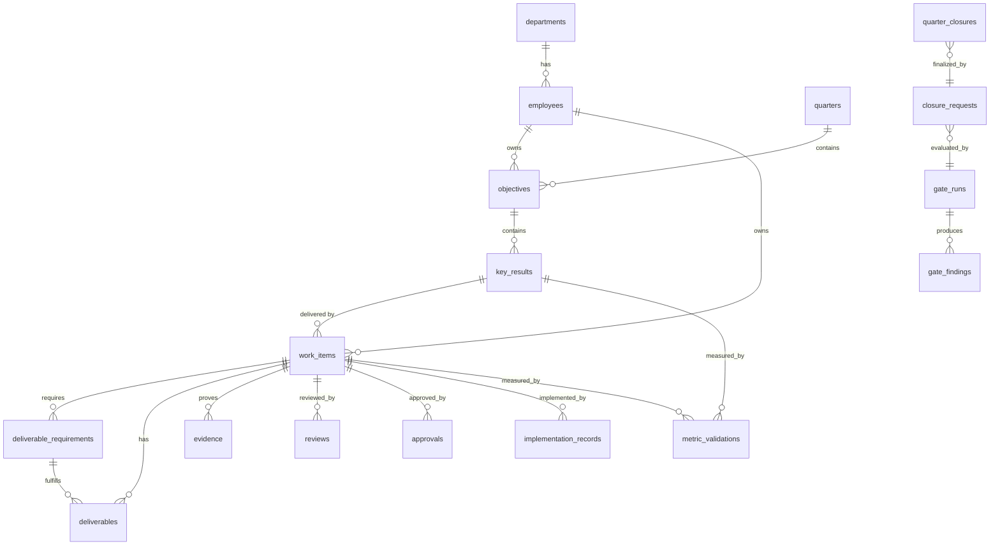

# Data model

Source of truth: `supabase/migrations/*.sql`. TypeScript mirror: `types/db.ts`.

## Entities (§7 of the master prompt)

| Table | Purpose | Notable integrity rules |
|---|---|---|
| `departments` | Org units, director linkage | unique code; self-FK parent |
| `employees` | People + `system_role`; `auth_user_id` linked on first Google login | unique email/code; `manager_id ≠ id` |
| `quarters` | `2026-Q3` periods with status | `quarter ∈ 1..4`; `code = YYYY-QN` check; `end > start` |
| `objectives` | Per employee+quarter, weighted | weight 0–100; unique (employee, quarter, code) |
| `key_results` | Weighted, measurable, deadline | `CLOSED ⇒ closed_at`; achievement 0–100 |
| `work_items` | Governed work; the heart of the system | `CLOSED ⇒ closed_at`; **`approver_id ≠ owner_id`** (segregation); status changes trigger-guarded |
| `deliverable_requirements` | What a work item must produce | unique name per work item |
| `deliverables` | Drive-referenced outputs with `vX.Y` versions | version regex; Drive URL allowlist; approval snapshots `approved_modified_time` |
| `evidence` | Drive/external/system proof, verification | `verified ⇒ verified_by+at`; must carry a link or description; cannot be born verified (RLS) |
| `reviews` | G3 — SELF_QC/FUNCTIONAL/LEGAL/… decisions | comment mandatory for RETURN/REJECT (check); one PENDING per (work, type, reviewer) |
| `approvals` | G4 — distinct from reviews, version-referenced | comment mandatory for RETURN/REJECT; **one PENDING per (work, type)** partial unique index; owner-approval blocked by trigger |
| `implementation_records` | G5 — NOT_REQUIRED…LIVE/ROLLED_BACK | LIVE/PILOT ⇒ implemented_at |
| `metric_validations` | G6 — target vs actual, validated by a person | PASS/FAIL ⇒ validated_by+at; belongs to KR and/or work |
| `gate_rules` | Configurable rule registry (G1–G7 + warnings) | jsonb config allowed here only |
| `closure_profiles` | Per-work-type closure requirements (§16) | admin-editable; drives engine + SQL re-check |
| `gate_runs` / `gate_findings` | Immutable evaluation history | counts consistency check; findings resolution tracked |
| `closure_requests` | SUBMIT FOR CLOSURE per scope | **one open request per scope** (partial unique index); finalized only via SECURITY DEFINER |
| `quarter_closures` | Permanent quarter closure record / certificate | unique (quarter, employee) |
| `audit_logs` | Append-only; UPDATE/DELETE blocked by trigger | no secrets recorded |
| `notifications` | In-app notifications | recipient-scoped by RLS |
| `work_state_transitions` | Central allowed-transition table (§15) | consumed by the trigger and mirrored in TS |

## Impossible states prevented in the database

- work/KR `CLOSED` without `closed_at` — check constraints;
- transition jumps (e.g. `IN_PROGRESS → APPROVED`) — trigger vs `work_state_transitions`;
- `CLOSED` without the closure-function flag — trigger (`app.allow_close`);
- a work item created directly in `CLOSED` (or any advanced state by non-admins) — insert trigger;
- owner approving own work — check constraint + trigger + RLS;
- duplicate active approval for a stage / duplicate open closure request — partial unique indexes;
- RETURN/REJECT without a comment — check constraints;
- verified evidence without verifier/timestamp, or created pre-verified — check + RLS;
- negative weights, quarter ∉ 1..4, malformed versions/codes — checks and regexes.

## numeric/date conventions

`numeric` columns surface as strings through node-postgres (see `types/db.ts`); `date`
columns are forced to ISO `YYYY-MM-DD` strings by a type parser in `lib/db` so deadline
comparisons are timezone-safe.
