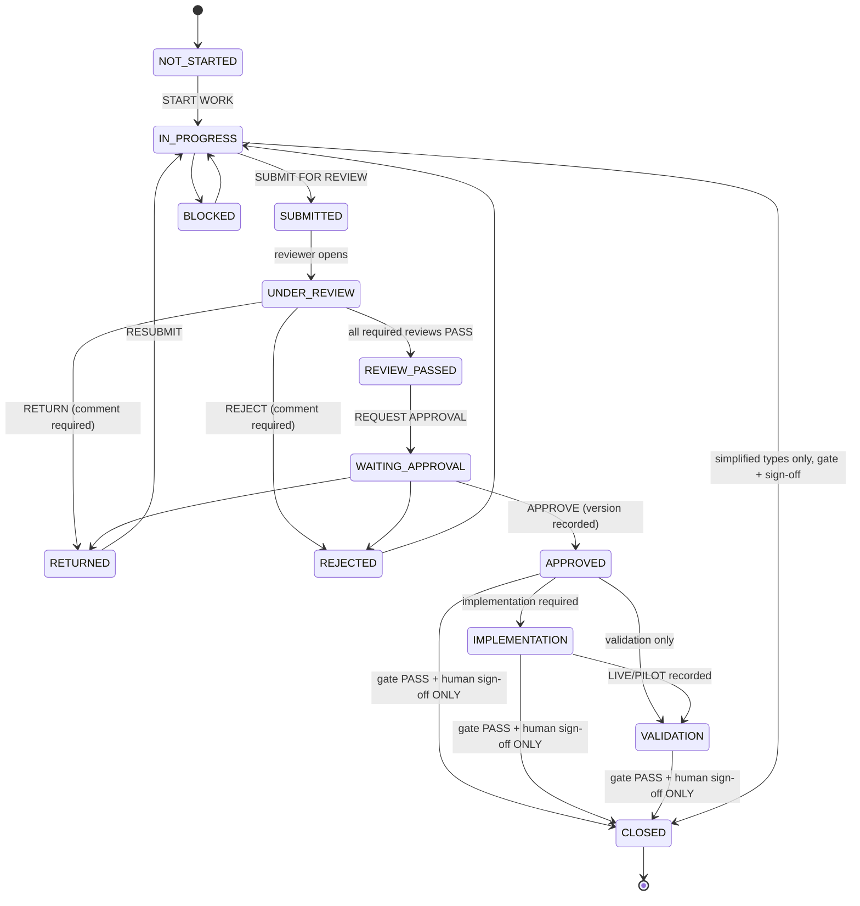

# Work lifecycle & governance workflow

## State machine (§15)

Transitions are defined once in the `work_state_transitions` table, enforced by a DB
trigger, and mirrored in `lib/workflow/state-machine.ts` for the UI. `CLOSED` is never a
user-driven target (see docs/GATE_ENGINE.md for the closure protocol).

## Who does what

| Step | Actor | Where |
|---|---|---|
| Create work (type → closure profile, DoD, reviewer, approver, deadline) | owner / manager / director | Миний ажил → Шинэ ажил |
| Attach deliverables (vX.Y, final flag), evidence, self QC | owner | Ажлын дэлгэрэнгүй |
| SUBMIT FOR REVIEW → FUNCTIONAL review opens for the assigned reviewer | owner | Ажлын дэлгэрэнгүй |
| PASS / RETURN / REJECT (comment mandatory on RETURN/REJECT) | reviewer | Хяналт (Review) queue |
| REQUEST APPROVAL (version-referenced) | owner | Ажлын дэлгэрэнгүй |
| APPROVE / RETURN / REJECT — approval snapshots final deliverables' Drive metadata | approver | Батлал (Approval) queue |
| Record implementation (PILOT/LIVE…), metric actuals | owner | Ажлын дэлгэрэнгүй |
| Validate metrics (PASS/FAIL) | reviewer/approver/director (never the owner alone) | Ажлын дэлгэрэнгүй |
| SUBMIT FOR CLOSURE → gate run | owner | Ажлын дэлгэрэнгүй / KR хуудас / Миний OKR |
| Closure sign-off (work/KR/quarter) | approver or director; admin | Батлал queue |
| Quarter certificate | generated on quarter sign-off | Тайлан → Гэрчилгээ |

## Work type → closure profile (§16 defaults, admin-editable)

| Type group | Requires |
|---|---|
| POLICY/PROCEDURE/STANDARD/GUIDELINE/PROCESS | final deliverables + self QC + functional (+legal for POLICY, +process owner for PROCESS) review + director approval + evidence |
| PROCESS_IMPROVEMENT / CHANGE_PROPOSAL / PROJECT / AUDIT_ACTION | the above **+ implementation LIVE + validation** (proposal approval alone never closes a change) |
| AI_AGENT / AUTOMATION / PILOT | + implementation + validation + target metric |
| REPORT / ANALYSIS / COMMITTEE / MANAGEMENT_ASSIGNMENT / TRAINING | review/approval + type-specific evidence & metrics (training: completion metric) |
| SPRINT / BAU / KPI | simplified closure — self QC + evidence (KPI: + metric); may close from IN_PROGRESS through the same gate + sign-off protocol |

## Notifications (§37)

In-app, generated inside the same transaction as the event: review requested, review
passed, work returned/rejected, approval requested/returned, approved, closure sign-off
waiting, work/KR closed, quarter closed. Future channels (Gmail/Chat) plug into
`app.notify()` call sites without schema changes.
